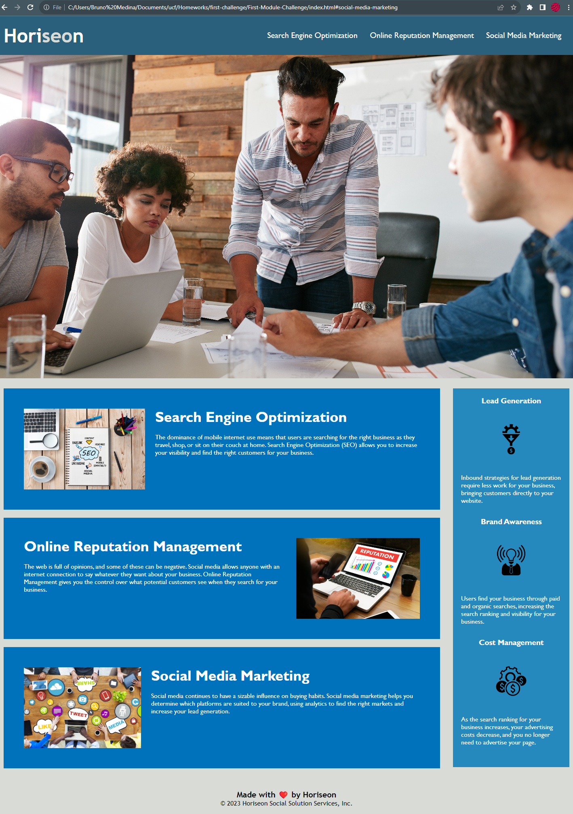

# First-Module-Challenge

## Description
This first challenged revolved around improving the accessibility of an existing website. We were hired by Horiseon to improve their website's accesibility with the end goal being to make the website more user-friendly for people with disabilities. When I vied the source code I quickly realised and help them get thier code to be better optimized.

### How to install and use the project 
1. Clone the repositiory to you machine.
2. Get to know the existing code provided.
3. Find different ways to improve the websites code to make it more accesible providing better alternatives. 

### Material Used 
1. https://www.w3schools.com/css/css_selectors.asp
2. https://robdodson.me/posts/css-semantics/
3. https://www.w3schools.com/html/html5_semantic_elements.asp